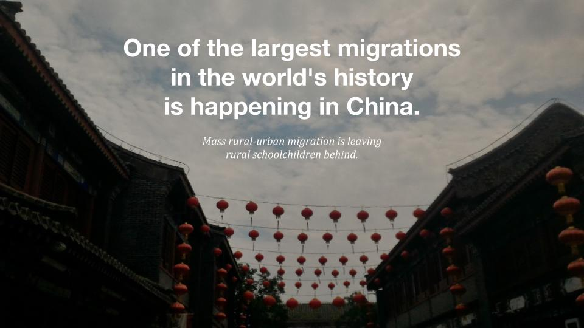

<h2>Ethnographic Research: How do students and teachers in rural Chinese elementary schools experience technology?</h2>

<h3>✨ Setting and Collaborators</h3>
For the 2019-2020 school year, I was awarded a <a href="https://news.stanford.edu/thedish/2019/06/10/twenty-seven-from-stanford-win-fulbright-u-s-student-program-grants/" target="\_blank">Fulbright Research Scholarship</a> to conduct ten months of original research and study in China by the U.S. Department of State.

Due to coronavirus, this research was postponed and then indefinitely suspended.

<h3>💭 Proposed research at Peking University:</h3>
I propose to explore and evaluate technological innovations for rural classrooms. New educational technologies have dramatically increased access to information and curriculum for thousands of left-behind children in the countryside, especially those who do not have steady access to teachers. The rapid advances in technology have the potential to bridge the rural-urban divide in education, but more research must be done to provide rural students an effective and holistic education backed by results. Aside from academic subjects like mathematics or history, a holistic education should also include non-academic aspects, such as social-emotional learning. Social-emotional learning involves the development of crucial cognitive and emotional skills such as emotion management, communication, collaboration, and mental well-being. Without it, students may be left with major emotional and cognitive delays, especially if they do not have a stable family environment. Research on social-emotional learning is burgeoning, and research on educational technologies for social-emotional learning is even more limited.

My research will be part of a larger project at the Peking University China Institute of Educational Finance Research. A team there is evaluating the impact of ULaiGongYi, an internet-based educational platform that live broadcasts sessions of urban classes to rural schools. Starting in 2018 and ending in 2020, the team will assess the platform by analyzing 80 schools in Qingcheng County of Gansu province. I have been invited to participate in their research group; I will help administer assessments related to students' social-emotional competence. This data will contribute to the research team's overall impact evaluation of ULaiGongYi, which will be used to make policy recommendations at the county and national level. Individually, for my Fulbright project, I will compile a framework of best practices for education technology developers in both the U.S. and China to incorporate social-emotional learning into educational platforms for rural students.

This project is of particular importance to me as my grandparents, originally from rural Hebei province, arrived as migrant workers in Beijing during the 1950s. Policy shifted rapidly, and had they arrived just a couple years later and not received their city registration card, or hukou, my father would have been barred from attending Beijing's public schools. Then, as it is now, a child without a city registration could not legally attend urban schools, access urban medical care, or apply for any governmental aid. My family narrowly made an arbitrary cutoff to gain urban citizenship. My dad went on to become the first in his family to attend university, as much through pure chance as through perseverance. My family story exposed to me the disparity of educational access in China and the needless gatekeeping mechanisms around it. There are very few degrees of separation between me and a rural child in Hebei Province, but I have a wealth of educational opportunities that they may not have dared to imagine. It is with this sense of urgency and understanding of my privilege that I hope to design more effective and accessible educational technologies for students on a global scale.

For more information about rural education in China, see <a href="https://reap.fsi.stanford.edu/docs/educational_challenges__education_for_migrant_children" target="\_blank">the Stanford Rural Education Action Program</a>.

<h3>🛠️ Tools Involved: </h3>

* Ethnographic classroom observations and interviews
* R and Matlab
