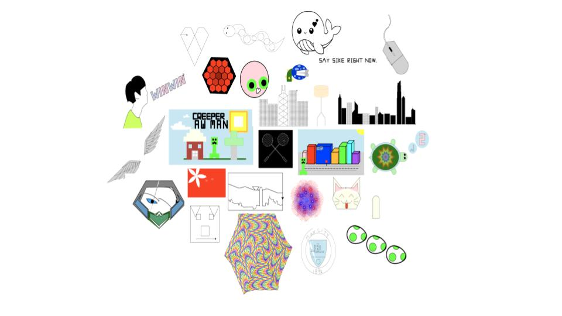
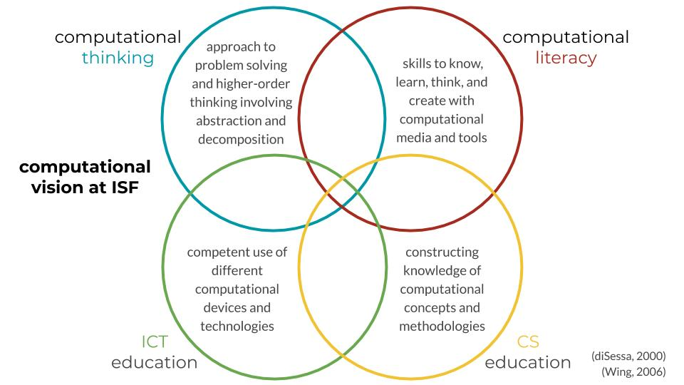

<h1><a href="/">&#8592;</a>{{ page.title }}</h1>
<h2>CS Ed Research: How do we reorient c.s. education to be about making with code?</h2>

(We asked our students to draw something personally meaningful, using  `python turtle`.)

<h3>✨ Setting and Collaborators</h3>
I joined as research assistant for the project spearheaded by Chris Proctor as part of the <a href="https://fablearn.org/research/" target="\_blank">Transformative Learning Technologies Lab</a>. This project was piloted at the Independent Schools Foundation Academy in Hong Kong from 2019 - 2021, where I worked alongside Jonathan Pang, Jacob Wolf, Krates Ng, Emma Brown.

<h3>✏️ Documentation</h3>
We're working on making this curriculum open-source for other teachers to adopt and adapt, at <a href="https://cs.fablearn.org/" target="\_blank"> cs . fablearn . org.</a>

You can find our course overview <a href="https://cs.fablearn.org/misc/grade-9-cs-options-brochure.html" target="\_blank">here.</a>

<h3>💭 Design Rationale</h3>
Our project was to develop and teach an introductory computer science class at the Independent Schools Foundation Academy in Hong Kong. Our class looked very different from a normal high school class.

Why was it so different? Because it was rooted in *constructionism*, a learning theory that stresses learning through making. We hoped students would adopt code as a tool with which to think and create, instead of as a subject that needed to be memorized and regurgitated. So:

* We didn't hand out tests (we assigned self-directed projects)
* We didn't focus on syntax (we focused on computational practices and concepts)
* We didn't use any kid-friendly code editors (we taught our beginners with authentic tools such as Github, Jupyter Notebook, and Python via Terminal and Atom)
* We didn't pretend to be the experts in the room (we invited our students to codesign and at times coteach the class)

We also worked as learning technology consultants alongside non-Computer Science teachers to integrate technology into their curriculum. For example, we experimented with <a href="http://unfold.studio/" target="\_blank">digital storytelling</a> in 7th Grade Classics and Augmented Reality in 6th Grade Drama.

In doing so, we also outlined a broader computational vision at the school:

